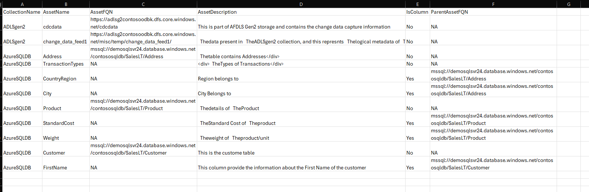
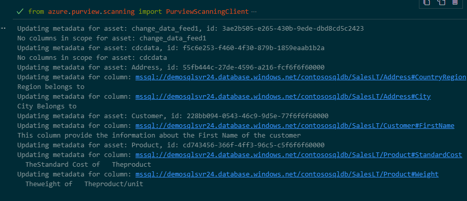
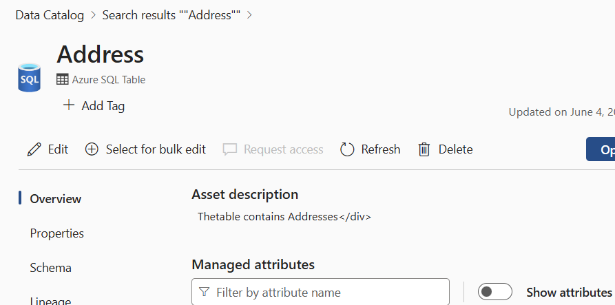

# Update Asset Metadata in Microsoft Purview using REST API automation

## Objective

After scanning the metadata, there may be a need to update certain assets in Microsoft Purview. For instance, updating the Description field of the assets and the description field of any table columns. In this case, we aim to update the asset metadata in Microsoft Purview using the REST API. We possess a CSV file where the asset descriptions intended for updates are maintained.


## Prerequisites

1. You already have an Azure Purview environment.
2. You have already created a service principal to authenticate to the Microsoft Purview Environment.
3. You have a python virtual environment where the required modules are already installed (requirements.txt).
4. Please follow the steps to [setup the authentication](https://learn.microsoft.com/en-us/purview/tutorial-using-rest-apis).
5. In the Azure Purview environment, you have already registered the Azure SQL DB as a datasource.


## create the python virtual environment 

In order to execute the script, we need to [create a python virtual environment](https://docs.python.org/3/library/venv.html) where we can install all the required modules from the requirement.txt file. 
`python -m venv <virtual_environmnet_name>`

## .env file.
.env file contains all the configuration values that is needed to execute the script. 
* CLIENT_ID= _Client ID of the service Principal_ 
* CLIENT_SECRET= _client secret of the the service Principal_
* TENANT_ID= _Tenant ID_
* PURVIEW_ACCOUNT_NAME= _Purview Account Name_
* SUBSCRIPTION_ID= _Subscription ID_

## Excel Spreadsheet

The Excel spreadsheet contains the asset metadata that needs to be updated in Microsoft Purview. The Excel spreadsheet contains the following columns:

**Here is the file : ./assetinfo.csv**

* **CollectionName**	- The name of the collection where the asset is present.
* **AssetName**	- The name of the asset.
* **AssetFQN**	- The fully qualified name of the asset.
* **AssetDescription**	- The description of the asset.
* **IsColumn**	-   A flag to indicate if the asset is a column.
* **ParentAssetFQN** - The fully qualified name of the parent asset. For example, the parent for column is table.



## Execute the script

Here are the high level steps we are performing in the script:

Here is the Script : create_update_metadata\update_asset_metadata.py

Once the virtual environment is created and the .env file is updated with the correct values, we can execute the script using the following command.

1. Authenticate to the Azure Purview environment.
Please note that if you would like to use EntraID authentication,, you can disable the service principal authentication and enable the EntraID authentication in the script. 

```python
def get_credentials():
    # credentials = ClientSecretCredential(client_id=client_id, client_secret=client_secret, tenant_id=tenant_id) # this portion is for service principal authentication
    credentials = AzureCliCredential() # this portion is for EntraID authentication
    return credentials
```
2. Read the CSV file.
3. Run the Loop for each collection that is present in the CSV file.
4. Getting all the assets that are present in the collection, and filtering based on the asset that is required to be updated from the CSV file.

```python
def queryCollection( collection_name, reference_name_purview):

    purview_endpoint = f"https://{reference_name_purview}.purview.azure.com"
    payload= {
        "keywords": "*",
        "filter": {
            "and" : [
                {
                    "or" :[
                        {
                            "collectionId":get_collection_Id(collection_name)
                        }
                    ]
                }
            ]
        }
        }
    
    # create the catalog client
    try:
        catalog_client = get_catalog_client(reference_name_purview)
    except ValueError as e:
        print(e)

    json_results = catalog_client.discovery.query(payload)
    
    return json_results

```
5. Update the asset metadata using the  API call.
6. Finding the column information and updating the column metadata based on the spreadsheet using the API call.
```python
   # update the metadata of the assets when its a Table

    for asset in assets_to_update:
        catalog_client = get_catalog_client(reference_name_purview)
        asset_name = asset['name']
        asset_id = asset['id']
        print(f"Updating metadata for asset: {asset_name}, id: {asset_id}")
        #getting the details of the entity, for example Table.
        entity_response = catalog_client.entity.get_by_guid(asset_id)
        _entity_response = entity_response
        # # remove the userDescription field from _entity_response['entity']['attributes']['userDescription']
        _entity_response['entity']['attributes'].pop('userDescription', None)
        # add the userDescription field from the csv file
        _entity_response['entity']['attributes']['userDescription'] = df[df['AssetName']==asset_name]['AssetDescription'].values[0]
 

        # getting the details of the columns by extracting out the referredEntities from the response.
        response_referredEntities = _entity_response['referredEntities']
        columns_guids = response_referredEntities.keys()

        # filter out the columns that are in scope from the csv file/ df_subset and mapped to the parent asset
        df_subset_columns = df_subset[(df_subset['ParentAssetFQN']==asset['qualifiedName']) & (df_subset['IsColumn']=="Yes")]
        # if df_subset_columns is not empty
        if not df_subset_columns.empty:
            for column_guid in columns_guids:
                column_metadata = response_referredEntities[column_guid]
                # check if column_metadata['attributes']['name'] is in the df_subset_columns['AssetName']
                if column_metadata['attributes']['name'] in df_subset_columns['AssetName'].tolist():
                    qualifiedName = column_metadata['attributes']['qualifiedName']
                    print(f"Updating metadata for column: {qualifiedName}")
                    _entity_response['referredEntities'][column_guid]['attributes'].pop('userDescription', None)
                    # add the userDescription field from the csv file
                    print(df_subset_columns[df_subset_columns['AssetName']==column_metadata['attributes']['name']]['AssetDescription'].values[0])
                    _entity_response['referredEntities'][column_guid]['attributes']['userDescription'] = df_subset_columns[df_subset_columns['AssetName']==column_metadata['attributes']['name']]['AssetDescription'].values[0]

        else:
            print(f"No columns in scope for asset: {asset_name}")
        catalog_client.entity.create_or_update(_entity_response)
```

## Output

After execution the script, we can see the updated metadata in the Microsoft Purview environment.


